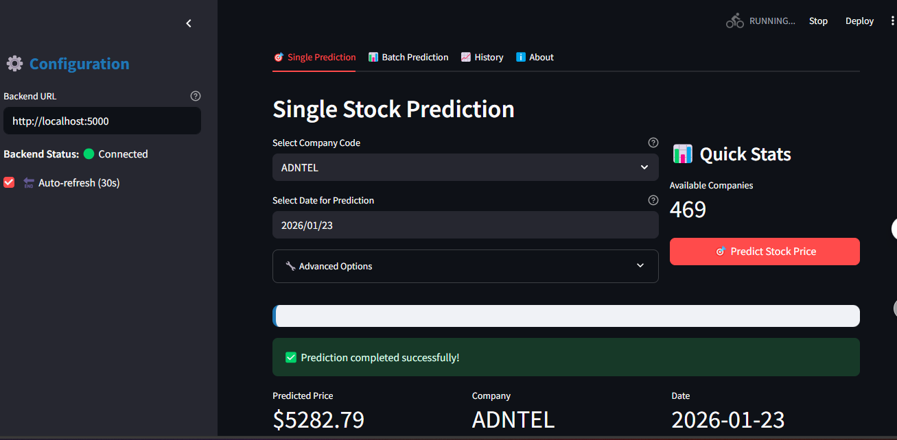

# 📈 Stock Market Prediction using News Headlines (Flask + Streamlit)

An intelligent stock price forecasting system powered by machine learning and NLP. This project predicts future stock prices based on historical trends and financial news headlines.

---

## 📂 Project Structure
```
stock_price_predictor/
├── backend/                   # Flask backend API
│   ├── app.py                 # Main Flask API server
│   ├── utils.py               # Feature builder during inference
│   └── model/                 # Model artifacts
│       ├── best_model_xgboost.pkl     # Trained ML model
│       ├── scaler_X.pkl               # Feature scaler
│       ├── scaler_y.pkl               # Target scaler
│       ├── label_encoder_code.pkl     # Label encoder for company codes
│       └── features.json              # List of input features
│
├── frontend/                 # Streamlit frontend app
│   ├── app.py                # Streamlit user interface
│   ├── static/               # (Optional) CSS or static assets
│   └── components/           # Modular UI components (optional)
│
├── assets/                   # Screenshots for documentation
│   ├── streamlit_ui.png
│   └── flask_api_docs.png
│
├── docker-compose.yml        # Docker integration (optional)
├── sample_input.csv          # Sample input data file
├── .gitignore                # Git ignored files and folders
└── README.md                 # Project documentation
```


---

## 🚀 Features

- 📅 Predict stock price based on **date** and **company**
- 🧠 NLP embeddings for news headlines using **Sentence-BERT**
- 💾 Support for pretrained ML models (XGBoost, LightGBM, LSTM)
- 🧮 Feature scaling and label encoding included in pipeline
- 💬 Streamlit web interface for user interaction
- 🧪 RESTful Flask API for backend predictions
- 🐳 Optional Docker support for full deployment

---

## 🧰 Tech Stack

| Layer      | Tools                                     |
|------------|--------------------------------------------|
| Backend    | Flask, Scikit-learn, XGBoost, LightGBM     |
| NLP        | Sentence-Transformers, BERT                |
| Frontend   | Streamlit                                  |


---

## 💻 Manual Local Run (Without Docker)

### 🧠 Backend (Flask API)

```bash
cd backend
pip install -r requirements.txt
python app.py
```

### Frontend (Streamlit)
```bash
cd frontend
pip install -r requirements.txt
streamlit run streamlit_app.py
```

## 🖼️ Screenshots

### 🔸 Streamlit App UI
